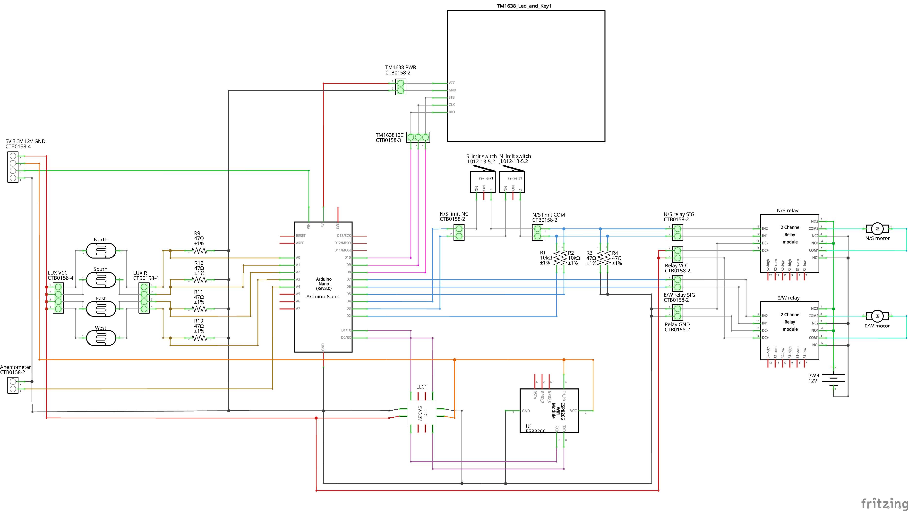
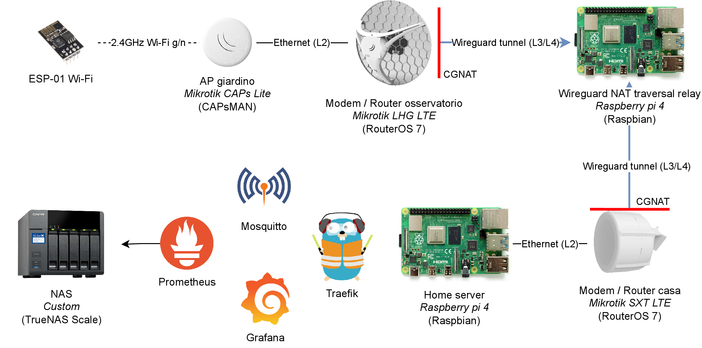
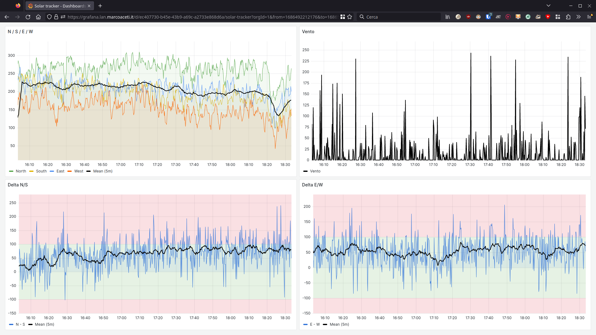
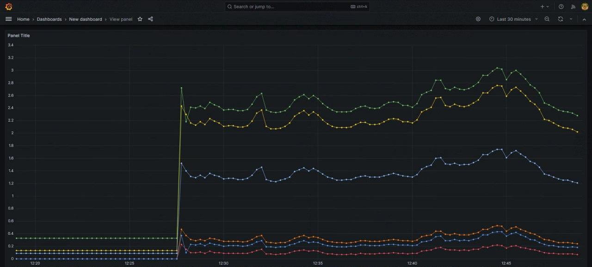

# Inseguitore solare

Autori: Daniele Ceribelli, Marco Aceti

## Descrizione

Il progetto consiste in una centralina di controllo per un inseguitore solare avanzato avente le seguenti funzionalità:
- __inseguire il Sole__: tramite l'ausilio di 4 fotoresistori, la centralina determina l'eventuale mossa dei motori per massimizzare l'efficienza dell'impianto fotovoltaico;
- __return-to-home automatico__: in caso di una situazione di scarsa luminosità (notte) o forte vento (rilevato mediante un anemometro analogico) la centralina posiziona il pannello solare in una posizione di sicurezza;
- __duplice modalità di funzionamento__: grazie all'uso del modulo display LED digitale TM1638, l'utente può selezionare due modalità distinte: _automatica_ (modalità predefinita) in cui la centralina agisce autonomamente o _manuale_ dove il movimento dei motori è determinato dalla pressione dei tasti sulla pulsantiera;
- __monitoraggio del funzionamento tramite MQTT__: la centralina &mdash; mediante la comunicazione tra i moduli Arduino Nano e ESP-01 &mdash; comunica a un server MQTT i valori dei sensori a fini di _quality-assurance_. 
Abbiamo infatti mostrato la possibilità di utilizzare applicazioni esterne come Prometheus e Grafana per creare visualizzazioni dei dati ricevuti consentendo una rapida rilevazione di eventuali problematiche garantendo un monitoraggio adeguato;
- __modello a loop chiuso__: per mezzo dell'utilizzo di due finecorsa e di un particolare circuito di retroazione, la centralina è in grado di pianificare le mosse successive anche in base allo stato reale del pannello.

## Lista materiali
- 1 x Arduino Nano
- 1 x ESP-01
- 4 x GL5528 fotoresistori
- 2 x motori DC
- 2 x 2 channel relay module
- 2 x finecorsa
- 1 x anemometro analogico
- 1 x TM1638
- 1 x logical level converter 5V - 3.3V
- 6 x resistenza 47 $\Omega$
- 2 x resistenza 10k $\Omega$
- 2 x AZDelivery breadboard power supply

## Schema elettrico

## Architettura di rete

## Risultati

### Video dimostrativi

- [__Timelapse__](https://youtu.be/kQvNaYo899s)
- [__Rilevazione vento__](https://youtu.be/sqIIk6i1DkY)

### Dashboard Grafana

## Difficoltà riscontrate

### Comunicazione tra Arduino e ESP

Al fine di garantire la corretta **comunicazione seriale** tra l'Arduino Nano e il ESP-01 è stato inanzitutto necessario disporre di un modulo **LLC** (Logical Level Converter) per convertire le tensioni dei segnali TX/RX rispettivamente di 5V e 3,3V.

Inizialmente, a **livello software**, abbiamo tentato di sfruttare il protocollo [**Firmata**](http://firmata.org/) designando l'ESP-01 come _master_ e l'Arduino come _slave_.
A quest'ultimo, infatti, eranno connessi tutti i segnali digitali e analogici ma solo il primo possedeva il modulo Wi-Fi per la comunicazione di rete.
Abbiamo quindi caricato [`StandardFirmata`](https://github.com/firmata/arduino/blob/main/examples/StandardFirmata/StandardFirmata.ino) sull'Arduino e uno sketch che usava [`FirmataMaster`](https://github.com/gmag11/FirmataMaster) sull'ESP.

Con l'**evoluzione dei requisiti iniziali**, in particolare con l'idea di aggiungere il modulo TM1638, ci siamo scontrati con i limiti dell'implementazione della libreria `FirmataMaster`, che **non supportava il protocollo I2C**.
Inoltre, la continua comunicazione tra Arduino ed ESP necessaria per qualsiasi lettura o scrittura dei pin GPIO  si traduceva in un **overhead di comunicazione superfluo**, nonché **potenzialmente suscettibile a errori**.

Di conseguenza, abbiamo deciso di __ritornare sui nostri passi__ invertendo i ruoli dei due protagonisti: avendo accesso diretto al metallo, infatti, l'overhead di esecuzione delle operazioni primitive di accesso al GPIO è stato azzerato.
Il protocollo Firmata è stato soppiantato dall'uso della libreria [**`ArduinoJson`**](https://arduinojson.org/) via seriale.

Per garantire la correttezza dello scambio di informazioni, abbiamo _wrappato_ l'oggetto Serial in una [`HammingEncodingStream`](https://github.com/bblanchon/ArduinoStreamUtils/blob/master/src/StreamUtils/Streams/HammingEncodingStream.hpp) della libreria [**`ArduinoStreamUtils`**](https://github.com/bblanchon/ArduinoStreamUtils/), aggiungendo il rilevamento e la **correzione degli errori** (ECC) di comunicazione automatica.

### Relay pull-down e retroazione

I segnali di controllo Nord / Sud attraversano i due **finecorsa**; se uno di essi viene attivato, il **segnale viene interrotto**, evitando la commutazione del rispettivo relay.
In quel caso però, il segnale destinato al relay è in **floating** e causando la commutazione involontaria. \
Per ovviare a questa problematica, abbiamo aggiunto un resistore __*pull down*__ tra il relay e GND.

Per lo stesso motivo abbiamo inoltre aggiunto una resistenza di tipo __*pull-up*__ tra il **segnale di retroazione** dal finecorsa alla board Arduino.

### Scelta del fotoresistore

Per determinare il livello di luminosità in ogni direzione, abbiamo deciso di utilizzare dei fotoresistori.

Per scegliere il modello di fotoresistore più adatto agli obiettivi del progetto, abbiamo adottato un approccio __*data-driven*__. 
Per raccogliere i dati abbiamo costruito un prototipo con tutti e sei i tipi di fotoresistori che avevamo a disposizione (GL5506, GL5516, GL5528, GL5537, GL5539, GL5549) e la logica per trasmettere i loro valori su MQTT ogni pochi secondi.

Con il già collaudato binomio Prometheus e Grafana, abbiamo facilmente identificato il fotoresistore più equilibrato: il **GL5528**.

### Alimentazione

Durante la fase di assemblaggio ci siamo accorti che la **massima potenza di erogazione** dell'alimentatore 5V / 3.3V da breadboard AZDelivery **non era sufficiente** a sopperire al carico richiesto.

Uno dei due **alimentatori** è quindi dedicato esclusivamente all'ESP-01 (il componente più energivoro) mentre l'altro ai relay.
Il TM1638 è alimentato dalla **porta 5V** dell'Arduino Nano, a sua volta collegato direttamente alla **12V** in ingresso.
